# analise_hotel_booking

- **Descrição**:Este é um projeto de análise de dados utilizando SQL, realizando uma análise exploratória de dados e compartilhando os insights obtidos através da base de dados *hotel booking demand* otida através do Kaggle.
- **Objetivos**: Analisar as reservas realizadas entre Julho de 2015 e Agosto de 2017 para responder perguntas de negócios relevantes e encontrar pontos a serem explorados em cada tipo de hotel analisado com a finalidade de aumentar os lucros da empresa.
- **Resultados**: 

## Descrição da Tabela
- ADR(Numérico): Tarifa média, valor de todas as transações de hospedagem dividido pelo número total de noites de estadia.
- Adults(Inteiro): Número de adultos na reserva.
- Agent(Categórica): ID da agência de viagens que fez a reserva.
- ArrivalDateDayOfMonth(Inteiro): Dia do mês da data de chegada.
- ArrivalDateMonth(Categórica): Mês da data de chegada, com 12 categorias("janeiro" a "Dezembro).
- ArrivalDateWeekNumber(Inteiro): Número da semana da data de chegada
- ArrivalDateYear(Inteiro): Ano da data de chegada.
- AssignedRoomType(Categórica): Código do tipo de quarto atribuído à reserva. O tipo atribuído pode ser diferente do reservado por questões operacionais ou a pedido do cliente. o Código vai de A até I, K, L e P.
- Babies(Inteiro): Número de bebês na reseva.
- BookingChanges(Inteiro): Número de alterações feitas na reserva desde a entreada no sistema até o check-in ou cancelamento.
- Children(Inteiro): Número de crianças na reserva, incluindo pagantes e não pagantes.
- Company(Categórica): ID da empresa responsável por fazer ou pagar a reserva.
- Country(Categórica): País de origem do cliente, representado no formato ISO 3155-3:2013.
- CustomerType(Categórica): Tipo de cliente, com quatro categorias diferentes:
    - Contract: Reserva associada a uma alocação ou outro tipo de contrato associado a ela.
    - Group: Reserva associada a um grupo.
    - Transient: Reserva individual, não associada a grupo ou contrato.
    - Transient-party: Reserva individual, mas associada a outras reservas individuais.
- DaysInWaitingList(Inteiro): Número de dias que a reserva permaneceu na lista de espera antes de ser confirmada.
- DepositType(Categórica): Tipo de deposito feito pelo cliente para garantir a reserva, com três categorias:
    - No Deposit: Nenhum depósito foi feito.
    - Non Refund: Depósito foi feito no valor total da estadia, não reembonsável.
    - Refundable: Depósito foi feito, mas abaixo do valor total da estadia, sendo reembolsável.
- DistribuitionChannel(Categórica): Canal de distribuição da reserva:
    - Corporate: -
    - Direct: -
    - GDS: -
    - TA/TO: "TA" - Agentes de viagens. "TO" - Operadores de turismo.
    - Undefined: Não informado.
- Hotel(Categórica): City Hotel ou Resort Hotel
- IsCanceled(Categórica): Reverva Cancelada (1). Reserva não cancelada (0).
- IsRepeatedGuest(Categórica): Hóspede repitido (1). Hóspede não repetido (0).
- LeadTime(Inteiro): Número de dias entre a data de inserção da reserva no sistema e a data de chegada.
- MarketSegment(Categórica): Segmento de mercado da reserva:
    - Aviation: -
    - Complementary: -
    - Corporate: -
    - Direct: -
    - Groups: -
    - Offline TA/TO: - "TA" - Agentes de viagens. "TO" - Operadores de turismo.
    - Offline TA: - "TA" - Agentes de viagens.
    - Undefined: Não definido.
- Meal(Categórica): Tipo de refeição reservada:
    - SC: Sem refeição.
    - BB: Café da manhã.
    - HB: Meia pensão (café da manhã e mais uma refeição, geralmente o jantar).
    - FB: Pensão completa (café da manhã, almoço e jantar).
- PreviousBookingsNotCanceled(Inteiro): Número de reservas anteriores que não foram canceladas pelo cliente.
- PreviousCancellations(Inteiro): Número de reservas anteriores canceladas pelo cliente.
- RequiredCardParkingSpaces(Inteiro): Número de vagas de estacionamento requeridas pelo cliente.
- ReservationStatus(Categórica): Último status da reserva, com três categorias:
    - Canceled: Reserva cancelada.
    - Check-Out: Cliente fez check-in, mas já fez check-out.
    - No-Show: Cliente não compareceu e não avisou o motivo.
- ReservationStatusDate(Data): Data em que o último status da reserva foi atualizado.
- ReservedRoomType(Categórica): Código do tipo de quarto reservado. Indo de A a H, L e P.
- StaysInWeekendNights(Inteiro): Número de noites de fim de semana (sábado ou domingo) incluídas na reserva.
- StaysInweekNights(Inteiro): Número de noites de semana (segunda a sexta) incluídas na reserva.
- TotalOfSpecialRequests(Inteiro): Número total de pedidos especiais feitos pelo cliente (ex: cama de solteiro, andar alto).

## Resultados encontrados:
O total de reservas realizadas no hotel da cidade representa um total de 66,45% da base de dados, enquanto o hotel resort corresponde a 33,55%. Devemos nos atentar a uma diferença no lucro que será explorada mais a frente.

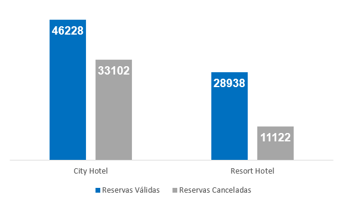

Na imagem abaixo podemos ver o percentual relativo de reservas válidas e canceladas. O hotel na cidade tem um total de 41,73% das reservas canceladas, já o hotel resort tem apenas 27,76% das reservas canceladas. 
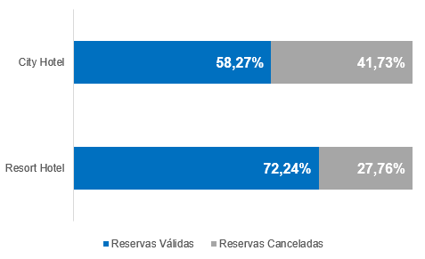

Mesmo com um grande número de reservas canceladas, o hotel na cidade ainda conta com 61,5% de reservas válidas em relação ao total com o hotel resort.

O gráfico abaixo mostra o total de hospedagens durante a linha de tempo documentada. Existem pontos a serem levados em consideração nos dois tipos de hotel:
- Hotel na Cidade:
  - Os dados oscilam durante dos meses, podemos ver que no primeiro mês tiveram menos de 500 hospedagens, tendo uma alta de 1986 hospedagens no mês de setembro, seguido por outra queda no mês de novembro, chegando a ter apenas 934 hospedagens, voltando a ter um pico entre os meses de março e abril. Podemos ver esse padrão se repetindo novamente em 2016 onde houve uma queda nas hospedagens no mês de novembro  com um pico após o mês de março.
- Hotel Resort:
  - Diferente do hotel na cidade, o hotel resort não tem uma oscilação com picos significativos durante os meses apresentados.
  - Podemos ver dois meses com mais reservas que os demais, ambos ocorreram no ano de 2016, atingindo a marca de pouco mais de 1400 hospedagens. Esse evento ocorreu nos meses de março e outubro.
  - A maior baixa observada ocorreu no mês de Janeiro de 2016, mas não ocorreu novamente durante os meses seguintes.
        
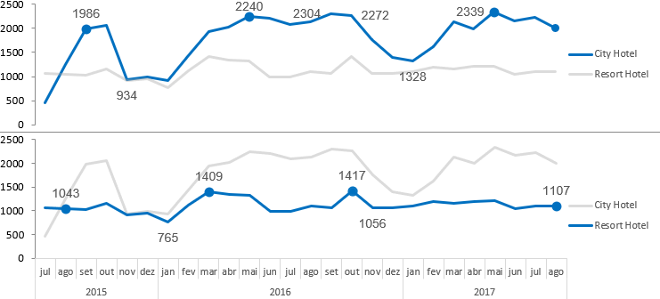

Uma análise na média gasta por hóspede mostra uma tendência diferente nos dois hotéis:
- Hotel na Cidade:
    - Os meses de Outubro a Março mostram um gasto médio por hóspede de aproximadamente 21,99% menor que nos demais meses.
    - Os meses de Agosto/Setembro e maio mostram um gasto médio de aproximadamente 19,60% maior que nos demais meses.
    - Diferente do total de hospedagem, o gasto médio por hóspede no hotel da cidade não apresenta uma mudança significativa ao decorrer dos meses.
- Hotel Resort:
    - Apresenta picos acentuados nos meses de julho, agosto e setembro, com sua alta sendo sempre em agosto. Esse evento acontece durante as férias de verão na região.
    - Os meses de Julho, Agosto e Dezembro tem um gasto médio por cliente de 118,91% maior que os outros meses.
    - Somente o mês de agosto tem um gasto médio por cliente de 125,95% maior que os outros meses.
    - O mês de dezembro (ano novo) apresenta uma alta de 40,99% em comparação com seus meses vizinhos (novembro e janeiro).
    - Enquanto as hospedagens no hotel resort não tem picos muito acentuados, o gasto médio por hóspede tem variações significativas para diferentes épocas do ano, como apontado nas férias de verão e ano novo.
 
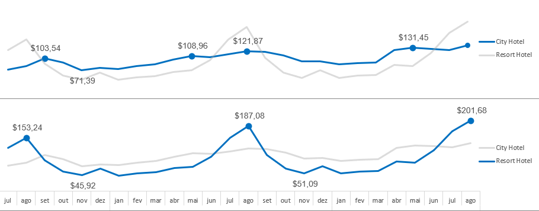

Análise do total gerado
- Hotel na Cidade:
    - Enquanto o número de reservas ao longo dos meses conta com picos de alta e baixa, a média de gasto por cliente não conta com esse ruído. Mesmo assim, meses com picos baixos de hospedagem são acompanhados com meses de uma baixa relativa na média gasta por clientes em relação a meses com alta de hospedagem, onde clientes acabam gastando mais dinheiro.
    - O gráfico do total gerado com hospedagens segue uma dispersão semelhante ao número de reservas válidas. Contudo, podemos observar picos mais acentuados no decorrer dos meses devido a uma correlação do aumento de reservas junto de um gasto maior por clientes na mesma época.
- Hotel Resort:
    - Diferente do hotel da cidade que o gráfico acompanha o número de hospedagens, o gasto total no hotel resort acompanha o gasto médio por cliente, mantendo seus picos de Julho, Agosto e Setembro, assim como um pico em Dezembro se comparado com os meses de Novembro e Janeiro.
    - Mesmo com os picos que ocorrem em Julho, Agosto e Setembro, o hotel Resort não ultrapassa o total gerado pelos clientes, devido ao alto número de hóspedes no hotel da cidade.

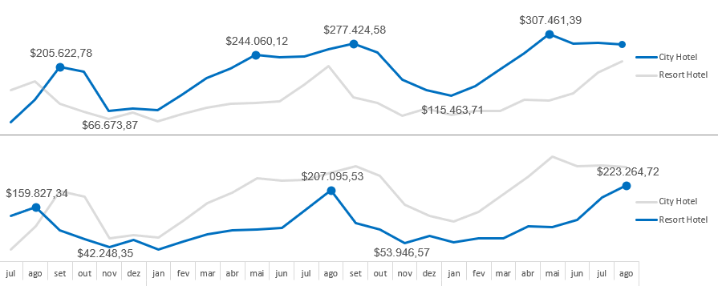

## Formas de aumentar a eficiência das reservas
Foram analisadas a taxa de cancelamento com quatro diferentes informações presentes nas reservas, são elas:
- Reservas realizadas com Agentes.
- Reservas realisadas com Empresas.
- O canal de distribuição informado na reserva.
- O tipo de cliente que realizou a reserva.

Primeiro iremos avaliar ações que podem ser tomadas no Hotel da Cidade para garantir um maior número de reservas válidas.
### Hotel na Cidade
#### Análise de reservas realizadas com Agentes
- O **cancelamento** de reservas realizadas **com Agentes** é de aproximadamente **33,47%** maior do que reservas realizadas **sem Agentes**

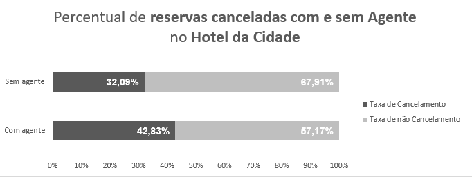

#### Análise de reservas realizadas com Empresas
- O **cancelamento** de reservas realizadas **sem Empresas** é de aproximadamente **100%** maior do  que reservas realizadas **sem Empresas**

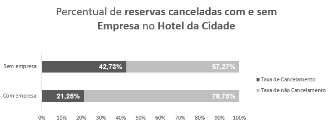

#### Análise de reservas em diferentes Canais de Distribuição
- As porcentagem de reservas canceladas em **TA/TO** ("TA" - Agentes de viagens. "TO" - Operadores de turismo.) é aproximadamente **95%** maior do que reservas canceladas no Canal de Distribuição de **Corporate**, o segundo Canal de Distribuição com mais reservas canceladas.
- Os Canais de Distribuição **Direct**(18%) e **GDS**(19%) contam com uma taxa de cancelamento parecida. O Canal de Distribuição **Corporate** não fica muito atrás, tendo somente 23%  das reservas canceladas.

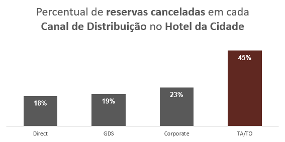

#### Análise de reservas com diferentes Tipos de Clientes
- Clientes(Group) que tem suas reservas associadas a grupos, contam com a menor taxa de cancelamento, com apenas **9,90%** das reservas desse tipo sendo canceladas.
- O maior problema é encontrado em clientes **Transient**(Reserva individual, não associada a grupo ou contrato) e **Contract**(Reserva associada a uma alocação ou outro tipo de contrato associado a ela), que contam respectivamente com **45,62%** e **48,04%** das reservas sendo canceladas.
- O cliente **Transient-Party**(Reserva individual, mas associada a outras reservas individuais) também conta com um número elevado de reservas canceladas se comparado com reservas realizadas por clientes **Group**, com uma taxa de cancelamento aproximadamente **180%** maior. Mesmo assim, é um tipo de cliente que tende a cancelar menos se comparado com as altas taxas de cancelamento de **Transient** e **Contract**

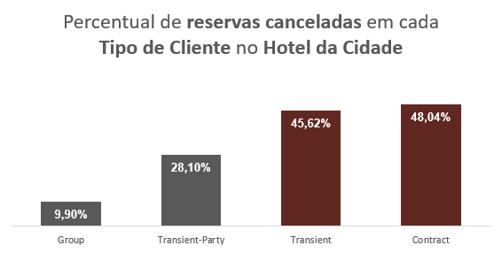

### Hotel Resort
#### Análise de reservas realizadas com Agentes
- Assim como acontece no Hotel da Cidade, o Hotel Resort tem uma taxa de cancelamento menor em reservas realizadas **sem Agentes** em comparação a reservas canceladas **com Agentes**.

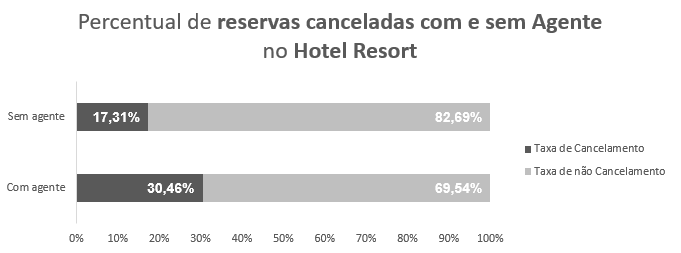

#### Análise de reservas realizadas com Empresas
- O **cancelamento** de reservas realizadas **sem Empresas** é aproximadamente **121%** maior do que reservas canceladas **com Empresas**.

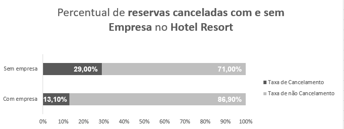

#### Análise de reservas em diferentes Canais de Distribuição
- Assim como ocorre nos **Canais de Distribuição** do Hotel da Cidade, existe uma diferença notável entre reservas canceladas no **Canal de Distribuição** **TA/TO** para os demais.
- Os **Canais de Distribuição** **Direct** e **Corporate** mantém uma margem de cancelamento aproximadas.

#### Análise de reservas com diferentes Tipos de Clientes
- **Clientes** **Contract** e **Group** tem um baixo percentual de cancelamento.
- O **Cliente** **Contract** conta com apenas **8,84%** das suas reservas canceladas, um número completamente diferente do que acontece no **Hotel da Cidade**, onde a maior taxa de cancelamento ocorre para esse tipo de cliente.
- **Clientes** **Transient-Party** tem  **84,66%** a mais de suas reservas **canceladas** em comparação a **clientes** **Group**, mas é relativamente menor do que clientes **Transient**.
- **Clientes** **Transient** tem **59,85%** a mais de suas reservas **Canceladas** em comparação com **Clientes Transiet-Party**.

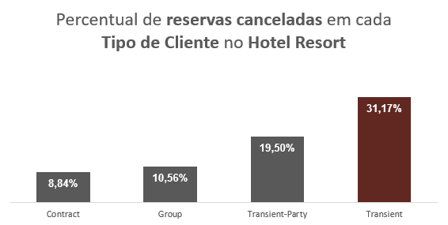

### Como aumentar a lucratividade do Hotel
#### Hotel na Cidade
- Reservas **sem Agente** tendem a ter uma taxa menor de cancelamento.
- Promoção para reservas realizadas com **Empresa** pode aumentar o número de reservas válidas, já que reservas desse tipo contam com menos da metade de cancelamento que acontece em reservas para clientes sem **Empresa**.
- Focar em clientes com **Canal de Distribuição** **Direct, GDS e Corporate** também pode influenciar positivamente nas reservas válidas, já que clientes **TA/TO** contam com um número alto em comparação com os demais.
- Clientes **Group** tem um baixo percentual de cancelamento, de apenas **9,90%**. Propagandas para esse Tipo de cliente pode ser uma boa abordagem.
- Clientes **Transient-Party** tem uma taxa de cancelamento relativamente maior que clientes **Group**, mas menor que clientes **Transient**. Devido a isso, programas que incentivem clientes **Transient** a se reservarem como clientes **Transient-Party** pode ser uma boa metodologia para diminuir o número bruto de cancelamento.  

#### Hotel Resort
- Assim como no **Hotel na Cidade**, as reservas no **Hotel Resort** tem uma taxa de **cancelamento** **menor** quando feitas sem um **Agente**
- Seguindo a mesma linha do **Hotel na Cidade**, é possível que promoções para incentivar reservas **Com Empresa** aumentem o número bruto de hospedagens não canceladas.
- O **Cancelamento** de reservas no **Hotel Resort** é razoavelmente menor se comparado com o **Hotel na Cidade**. Mesmo assim, pode seguir a mesma linha para **Canais de Distribuição**. Focando esforços para alojar hóspedes provenientes do **Canal de Distribuição** **Direct** e **Corporate**.
- **Clientes** **Contract** e **Group** tem uma baixa taixa de cancelamento, podendo ser um ótimo **público-alvo**.
- **Clientes Transient-Party** tem uma taxa de **cancelamento** menor que clientes **Transient**, o que torna interessante a criação de programas que incentivem clientes **Transient** se tornarem clientes **Transient-Party**.

## Dataset
- Dataset coletado no Kaggle.
- Link: https://www.kaggle.com/datasets/jessemostipak/hotel-booking-demand
## Contato
- Linkedin: https://www.linkedin.com/in/gabrielhlenz/
- Github: https://github.com/GabrielhLenz
- Email: gabrielxlenz@gmail.com
